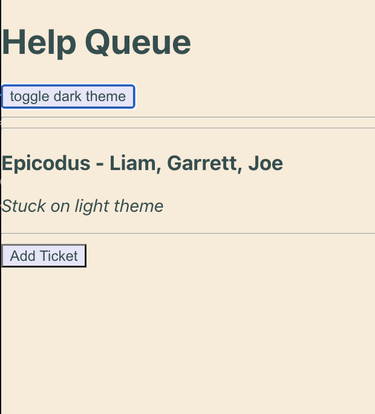
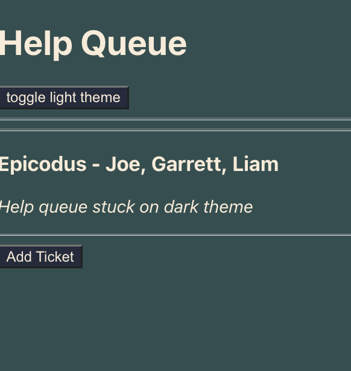

# Help Queue

## A hlep queue ticket creating app with light and dark themes.

### By Liam Campbell, Garrett Hayes, Joe Roaden

<div>

 

</div>

## Table of Contents

**[Technologies Used](#technologies-used)  
[Description](#description)  
[Setup/Installation Requirements](#setup-and-installation-requirements)  
[Known Bugs](#known-bugs)  
[License](#license)**

## Technologies Used

* _React.js_
* _HTML_
* _Node.js_
* _JavaScript_
* _Jest_

## Description 

_This site allows a user to in put details for the creation of a tech support ticket. This site lends a user full CRUD functionality. They can create, read, update, and delete one ticket. All tickets will be displayed in a list and users can click on the ticket to get further details, edit or delete that ticket. There is also a toggleable light/dark theme available, created using context._


## Setup/Installation Requirements

* Clone this repository from [github](https://github.com/lcmpbll/help-queue2) to your desktop.
* Navigate to the top level of the directory.
* In your terminal console `$cd to help-queue2`
* ```$npm install```
* ```npm run start```

### Available Scripts
_In the project directory you can run:_

#### ```$npm start```
_Runs the app in the development mode._
_Open http://localhost:3000 to view in your browser._

_The page will reload when you make changes_
_You will also see any errors in the console._

#### ```$npm test```

_Lanches the test runner in the interactive watch mode._

#### ```$npm run build```

_Builds the app for production to the build folder._
_It correctly bundles React in production mode and optimizes the build for best performance._

_The build is minified and the file names include hashes._

### Known Bugs

* None

## License

_Feel free to reach out via [Github](github.com.lcmpbll) to provide feedback on this project or to view my other projects._

[Copyright](LICENSE) (c) _09-27-2022_ _Liam Campbell, Joe Roaden, Garrett Hayes_